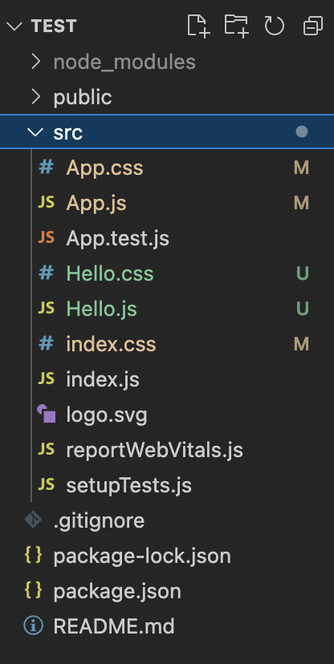

# 5. 컴포넌트
{: .no_toc }

## Table of contents
{: .no_toc .text-delta }

- TOC
{:toc}

---

## 컴포넌트?
{: .fs-8 }

> 리액트에게 화면에 표현하고 싶은 게 무엇인지 우리는 컴포넌트를 통해 알려줍니다. 리액트는 데이터가 변경될 때 컴포넌트를 효율적으로 업데이트하고 다시 렌더링합니다.

- 리액트를 사용하면 `컴포넌트`라는 재사용가능한 UI 파편을 통해 복잡한 앱을 효율적으로 만들 수 있습니다.

- `컴포넌트`는 **재활용 가능한 UI 구성 단위**{: .text-purple-000 }입니다. UI가 재활용 가능하다는 것은 리액트의 큰 장점 중 하나이며, 서비스의 유지보수 측면에서 뛰어나고 페이지의 구성을 한눈에 파악할 수 있습니다.

&nbsp;

### 컴포넌트 단위 개발 (Component Based Development)
{: .fs-6 }

**리액트는 컴포넌트 단위로 개발해야 합니다.**{: .text-purple-000 } 컴포넌트는 사용자 입장에서는 HTML 요소와 크게 다르지 않습니다. 예를 들어, `` 태그나 `<button></button>` 태그와 같은 기능을 리액트 컴포넌트로 만든다고 했을 때, 우리는 `props`라는 속성을 사용해서 해당 기능을 구현할 수 있습니다.

&nbsp;

**구현할 HTML 요소**{: .text-grey-dk-200 }

```html
<div>Hello, Devbot</div>
```

&nbsp;

**index.html**{: .text-grey-dk-200 }

```html
<body>
        <noscript>You need to enable JavaScript to run this app.</noscript>
        <div id="root"></div>
</body>
```

&nbsp;

`<body></body>` 태그 내부의

```html
<div id="root"></div>
```

`root`라는 아이디를 가지고 있는 요소 내부에 리액트는 렌더링 됩니다. `index.html` 파일은 다른 컴포넌트 파일과 달리 `src` 폴더가 아닌 `public` 폴더 내부에 있습니다.

&nbsp;

**index.js**{: .text-grey-dk-200 }

```jsx
import React from 'react';
import ReactDOM from 'react-dom/client';
import './index.css';
import App from './App';
import reportWebVitals from './reportWebVitals';

const root = ReactDOM.createRoot(document.getElementById('root'));
root.render(
        <React.StrictMode>
                <App/>
        </React.StrictMode>
);

// If you want to start measuring performance in your app, pass a function
// to log results (for example: reportWebVitals(console.log))
// or send to an analytics endpoint. Learn more: https://bit.ly/CRA-vitals
reportWebVitals();
```

&nbsp;

코드 중단의

```jsx
const root = ReactDOM.createRoot(document.getElementById('root'));
```

이 코드는 `index.html` 파일 내부의 `root`라는 아이디를 가지고 있는 요소 내부에 리액트를 렌더랑한다는 것을 의미합니다.

&nbsp;

**App.js**{: .text-grey-dk-200 }

index.html에 넣을 컴포넌트

```jsx
import React from 'react';
import Hello from './Hello';

function App() {
        return (
                <Hello/>
        );
}
```

&nbsp;

코드 상단의

```jsx
import Hello from './Hello';
```

이 코드는 Hello라는 이름의 컴포넌트를 불러오겠다는 뜻입니다. Hello라는 컴포넌트를 생성하지 않았을 경우 당연하게도 아무것도 뜨지 않습니다.

&nbsp;

**Hello.js**{: .text-grey-dk-200 }

App.js에 넣을 컴포넌트

```jsx
import React from 'react';

function Hello() {
        return (
                <div>Hello, Devbot</div>
        );
}

export default Hello;
```

&nbsp;

코드 하단의

```jsx
export default Hello;
```

이 코드는 Hello라는 이름의 컴포넌트를 내보내겠다는 뜻입니다. 이렇게 해주면 외부에서 Hello 컴포넌트를 불러와서 사용할 수 있습니다.

&nbsp;

이제 이 코드를 로컬서버에서 실행하면 아래와 같이 표현됩니다. 스타일링을 따로 하지 않았기 때문에 브라우저의 기본 폰트 패밀리와 폰트 크기를 계승합니다.


&nbsp;

리액트 공식 홈페이지는 컴포넌트를 '재활용가능한 UI 구성 단위'라고 정의합니다. **컴포넌트가 재활용가능하다는 것은 리액트의 가장 큰 장점 중 하나**{: .text-purple-000 }입니다. 컴포넌트 재활용에 대한 예시는 다음과 같습니다.

```jsx
import React from 'react';
import Hello from './Hello';

function App() {
        return (
                <>
                        <Hello/>
                        <Hello/>
                        <Hello/>
                </>
        );
}
```


&nbsp;

`Hello` 컴포넌트를 여러개 썼을 때, 기존과 다르게 `<></>` 태그로 감싼 걸 볼 수 있습니다.

```jsx
<>
        <Hello/>
        <Hello/>
        <Hello/>
</>
```

`<></>` 태그로 감싼 이유는 **'반드시 하나의 부모요소가 감싸는 형태여야 한다.'**{: .text-purple-000 }는 JSX 문법 때문입니다. 위처럼 빈 태그를 넣어도 되고, `<div></div>`나 `<span></span>` 등 기존 HTML 태그를 넣어도 됩니다.

&nbsp;

### 컴포넌트 스타일링
{: .fs-6 }

컴포넌트는 CSS를 이용해 스타일링 할 수 있습니다.

&nbsp;

**Hello.js**{: .text-grey-dk-200 }

```jsx
import React from 'react';
import './Hello.css'

function Hello() {
        return (
                <div className='hello'>Hello, Devbot</div>
        );
}

export default Hello;
```

&nbsp;

**Hello.css**{: .text-grey-dk-200 }

```css
.hello {
        font-size: 20px;
        font-weight: 700;
        color: blue;
}
```

&nbsp;


&nbsp;

코드 상단의

```jsx
import './Hello.css';
```

이 코드를 통해 컴포넌트에 css파일을 불러올 수 있습니다. 코드는 절대경로와 상대경로, 둘 중 하나를 선택해 사용할 수 있습니다. 아래와 같이 test라는 root 폴더가 있다고 했을 때, 절대경로의 경우 `/src/Hello.css`, 상대경로일 경우 `./Hello.css`를 통해 파일을 불러올 수 있습니다.



&nbsp;

이외에도, 컴포넌트는 다양한 방식으로 활용될 수 있습니다. HTML 코드말고도 자바스크립트 계산식을 return하는 컴포넌트를 만들수도 있고, `props`를 통해 상위 컴포넌트의 데이터를 하위 컴포넌트로 전달받을수도 있습니다.

&nbsp;

## Reference
{: .fs-8 }

- [[React] React 기본 개념](https://velog.io/@kim-jaemin420/React-%EA%B8%B0%EB%B3%B8-%EA%B0%9C%EB%85%90)

&nbsp;

<script src="https://utteranc.es/client.js"
        repo="xxdevbosa/blog"
        issue-term="pathname"
        label="blog"
        theme="github-light"
        crossorigin="anonymous"
        async>
</script>