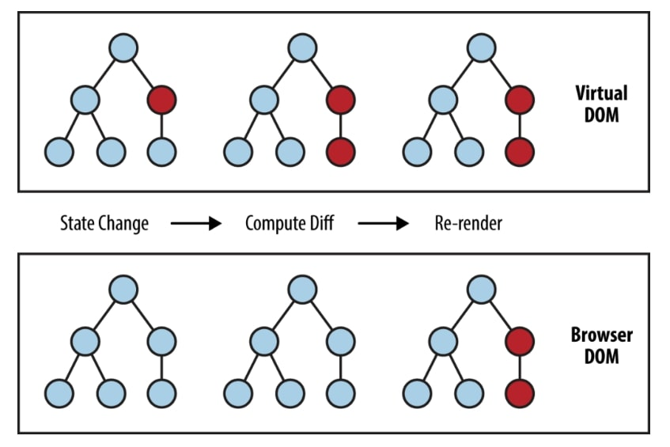

# 3. 가상 돔(Virtual DOM)
{: .no_toc }

## Table of contents
{: .no_toc .text-delta }

- TOC
{:toc}

---

## 가상 돔(Virtual DOM)
{: .fs-8 }

리액트는 실제 브라우저 문서 구조가 아닌 `가상 돔`이라고 하는 가상의 문서 구조를 만들어 브라우저에 렌더링합니다. 

리액트에서 `가상 돔`을 사용하는 이유는, `상태(State)`가 변했을 때 브라우저 전체가 아닌 기존의 DOM과 비교해서 달라진 부분만 변경한다.

이러한 방식은 이전 UI 상태를 메모리에 유지한 체, 변경될 UI의 최소집합을 계산하여 필요한 부분만 교체하여 **불필요한 업데이트를 줄이고, 렌더링 속도를 올려준다.**{: .text-purple-000 }