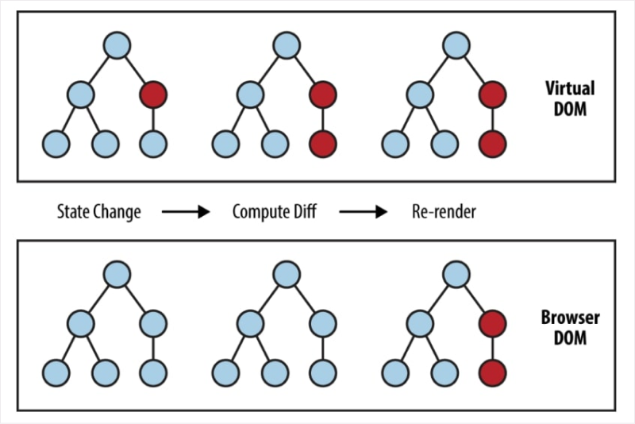

# 가상 DOM
{: .no_toc }

## Table of contents
{: .no_toc .text-delta }

- TOC
{:toc}

---

## DOM이란?
{: .fs-8 }

DOM이란 **D**{: .text-purple-000 }ocument **O**{: .text-purple-000 }bject **M**{: .text-purple-000 }odel (문서 객체 모델)의 약자입니다. 문서 객체 모델은 브라우저에서 `HTML 태그`를 `객체(Object)`로 만들어 프로그래밍 언어가 DOM 구조에 접근하는 것을 돕는 역할을 합니다. 

> 한마디로 문서 객체 모델은 문서 내의 모든 요소를 정의하고, 각각의 요소에 접근하는 방법을 제공합니다.

&nbsp;

### DOM을 렌더링하는 과정
{: .fs-6 }

1. 브라우저는 서버가 보내준 HTML 파일을 해석(Parsing)하여 `DOM 트리`를 만듭니다.
2. 브라우저는 서버가 보내준 CSS 파일을 해석(Parsing)하여 `CSSOM 트리`를 만듭니다.
3. DOM 트리 + CSSOM 트리를 결합한 `렌더트리`를 만듭니다.
4. 렌더트리로 각 노드의 위치와 크기를 계산한 `레이아웃`을 만듭니다.
5. `뷰포트` 내에서 각 노드들의 위치와 크기를 계산합니다.
6. 레이아웃 계산이 완료되면 요소들을 실제 화면에 `페인트(Paint)`합니다.

&nbsp;

### DOM의 문제점
{: .fs-6 }

- 새로운 요청이나 변경사항이 있을 때마다 전체를 다시 렌더링합니다.
- 요청이나 변경사항이 있을 때마다 매번 새롭게 DOM 전체를 렌더링 하기 때문에, `레이아웃`의 양이 많을 경우 렌더링 속도가 현저히 느려지게 됩니다.

&nbsp;

## 가상 DOM
{: .fs-8 }

가상 DOM은 주로 `React`, `Vue`, `Elm` 등에서 사용되며, 실제 브라우저 문서 구조가 아닌 `가상 DOM`이라고 하는 가상의 문서 객체를 만들어 브라우저에 렌더링합니다.

&nbsp;

### 리액트에서 가상 DOM을 사용하는 이유
{: .fs-6 }

리액트에서 `가상 DOM`을 사용하는 이유는, `상태(State)`가 변했을 때 브라우저 전체가 아닌 기존의 DOM과 비교해서 달라진 부분만 변경하기 때문입니다.

이러한 방식은 이전 UI 상태를 메모리에 유지한 체, 변경될 UI의 최소집합을 계산하여 필요한 부분만 교체하여 **불필요한 업데이트를 줄이고, 렌더링 속도를 올려줍니다.**{: .text-purple-000 }

&nbsp;

### 가상 DOM을 렌더링하는 과정
{: .fs-6 }

1. `상태(State)`가 바뀌면 UI를 가상 DOM에 렌더링합니다.
2. 가상 DOM끼리 비교합니다.
3. 바뀐 부분만 실제 DOM에 렌더링합니다.

&nbsp;

## DOM VS Virtual DOM
{: .fs-6 }

|             | `DOM`                 | `Virtual DOM`          |
|:------------|:----------------------|:-----------------------|
| 업데이트 방식  | 전체 업데이트             | 부분 업데이트             |
| 렌더링 속도    | 비교적 느리다             | 비교적 빠르다            |
| 메모리 누수    | 비교적 심하다             | 비교적 덜하다            |

&nbsp;

## Reference
{: .fs-8 }

- [[React] 가상 돔(Virtual DOM) 이해하기](https://devbirdfeet.tistory.com/219)
- [[React] DOM의 개념](http://www.tcpschool.com/javascript/js_dom_concept)

&nbsp;

