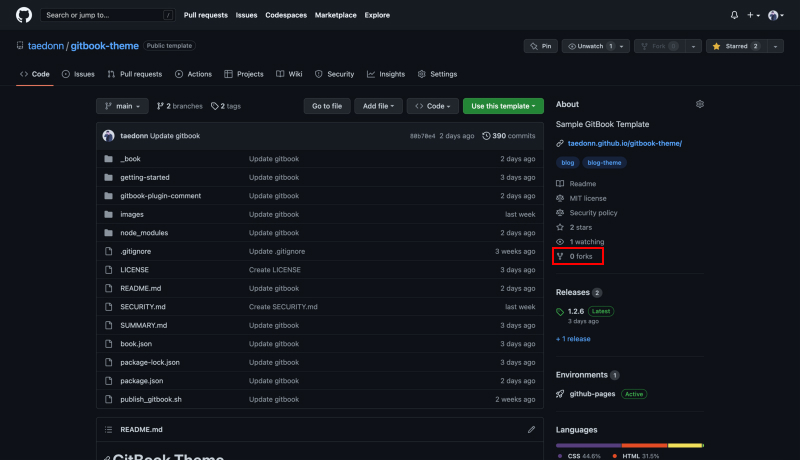
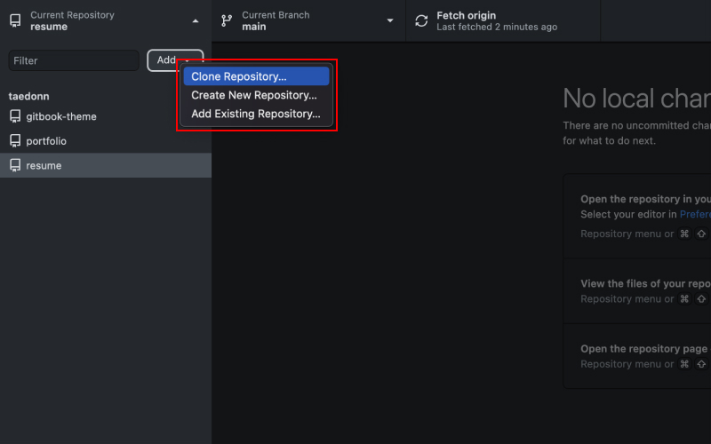
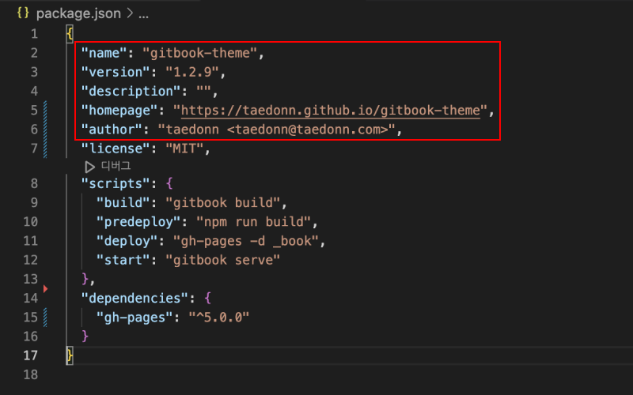
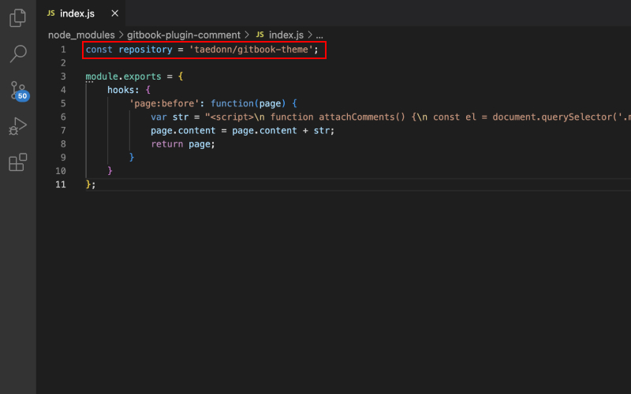
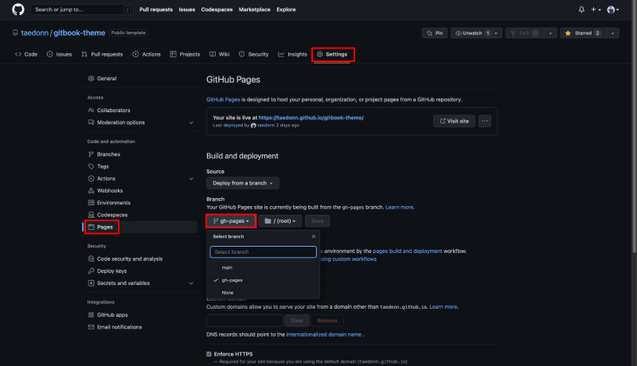

## GitBook 세팅하기

먼저 아래 GitHub 레포지토리로 들어갑니다.

[GitHub 레포지토리 바로가기](https://github.com/taedonn/gitbook-theme)



깃헙에 들어가면 오른쪽에 forks라고 되어있는 부분을 찾을 수 있습니다. 이 부분을 클릭해서 레포지토리를 Fork 합니다.

&nbsp;

#### (선택 1) git을 통해 내 로컬 디렉토리에 복제

fork가 완료되면, git을 통해 fork한 레포지토리를 로컬 디렉토리에 복제합니다.

```bash
git clone https://github.com/{내 아이디}/{내 저장소 이름}.git

// 예시
git clone https://github.com/taedonn/gitbook-theme.git
```

&nbsp;

#### Git을 사용해본 적이 없다면?

먼저 git을 설치해 줍니다.

> Git 설치하기<br>
[Windows](https://gitforwindows.org/) · 
[MacOS](https://sourceforge.net/projects/git-osx-installer/files/git-2.23.0-intel-universal-mavericks.dmg/download?use_mirror=autoselect)

&nbsp;

설치 후 터미널을 열고 초기 설정을 해줍니다.

##### 유저 이름 입력

```bash
git config --global user.name "내 깃허브 이름"
```

##### 유저 이메일 입력

```bash
git config --global user.email "내 깃허브 이메일"
```

&nbsp;

모두 입력하면 폴더를 복사할 위치를 정합니다.

##### 폴더 이동

```bash
# my-folder 폴더로 이동 (현재 위치에 my-folder 폴더가 없으면 이동 X)
cd my-folder

# 뒤로가기
cd ..
```

&nbsp;

#### (선택 2) GitHub Desktop 앱을 통해 내 로컬 디렉토리에 복제



Git 사용이 불편하다면 GitHub desktop app을 통해서도 쉽게 레포 복제가 가능합니다. 앱 설치 후 내 깃허브 아이디로 로그인하면 앱을 통해 레포를 로컬에 복제하거나 수정 사항을 바로 원격 저장소에 푸시할 수 있습니다.

> GitHub Desktop 설치하기<br/>
[설치 링크](https://desktop.github.com/)

&nbsp;

#### Gitbook 초기 설정



레포 복제가 완료되면, 복제된 폴더를 VSCODE를 통해 열고, package.json의 name, version, homepage, author 등을 본인 상황에 맞게 변경해 줍니다.

&nbsp;

#### (선택 사항) 댓글 기능 설정



댓글 기능을 구현하기 위해 gitbook-plugin-comment > index.js 파일을 열고 첫줄의 repository를 본인의 저장소 이름으로 변경한 후 코드 전체를 복사합니다. 그런 다음 node_modules > gitbook-plugin-comment > index.js 파일로 이동해 기존 코드를 복사한 코드로 덮어 씌웁니다.
> gitbook install 커멘드를 사용하면 node_modules > gitbook-plugin-comment > index.js 파일이 초기화 됩니다. 이런 경우를 대비해 루트 폴더에 gitbook-plugin-comment 폴더를 만들어 놓았으니, 안에 index.js 파일을 그대로 복붙해서 사용하면 됩니다.

&nbsp;

#### GitHub Pages에 배포하기

설정을 완료하면, 터미널에 아래 커멘드를 입력합니다.

```js
npm run deploy
```

이 커멘드를 입력하면 내 로컬 디렉토리에 _book 폴더가 생성되고 변경사항이 gh-pages 브랜치에 푸시됩니다.
> 깃허브 페이지로 배포하는 게 아니고 외부로 배포하는 거라면, _book 폴더를 루트 폴더로 설정한 후 배포하면 됩니다.

&nbsp;

#### main 브랜치에 배포하기

GitHub Desktop 앱을 사용중이라면, 수정 사항이 앱에 뜨기 때문에 그대로 커밋한 후 푸시하면 됩니다. git을 사용중이라면, 아래 커멘드를 순서대로 입력하면 됩니다.

```bash
# 수정사항 스테이징
git add .

# 수정사항 커밋
git commit -m "커밋 메세지(아무거나 입력 가능)"

# main 브랜치에 푸시
git push origin main
```

&nbsp;

#### 깃허브 페이지 배포 브랜치 변경



이제 github으로 돌아와 내 저장소에서 Settings > Pages로 들어가 Branch를 gh-pages로 변경합니다. 한번만 해주면 되고 이미 설정되어 있다면 따로 수정할 필요 없습니다.

5분정도 페이지 빌드가 완료될때까지 기다린 다음, 위에 Visit site 버튼을 눌러 사이트에 접속하면 깃북 테마가 적용된 블로그를 볼 수 있습니다.
> 5분을 기다려도 깃북 테마가 적용이 안될 경우, Ctrl(맥북은 cmd) + Shift + R을 눌러 강력 새로고침을 해보자.

&nbsp;

