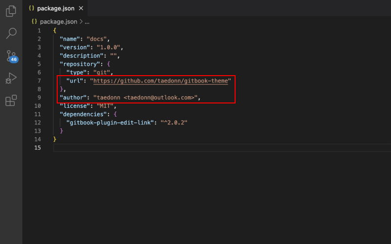
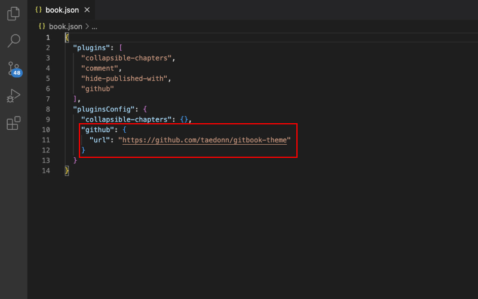
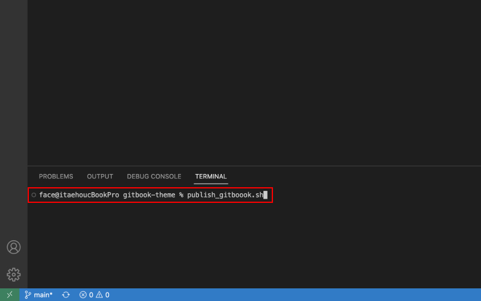

## GitBook 세팅하기

깃북 테마를 적용하기 위해, 먼저 아래 GitHub 레포지토리로 들어간다.

[GitHub 레포지토리 바로가기](https://github.com/taedonn/gitbook-theme)

&nbsp;

깃헙에 들어가면 오른쪽에 forks라고 되어있는 부분을 찾을 수 있습니다. 이 부분을 클릭해서 레포지토리를 Fork 합니다.

&nbsp;

내 레포지토리에 Fork가 완료되면, Git을 통해 레포지토리를 Clone합니다.
> Git 설치하기 
[Windows](https://gitforwindows.org/) · 
[MacOS](https://sourceforge.net/projects/git-osx-installer/files/git-2.23.0-intel-universal-mavericks.dmg/download?use_mirror=autoselect)

&nbsp;

클론이 완료되면, 클론된 폴더를 VSCODE를 통해 열고, 설정값을 변경해줍니다. 우선 package.json의 url을 본인 url에 맞게 변경합니다. url 형식은 "https:/github.com/깃헙아이디/레포지토리명" 입니다.

&nbsp;

package.json과 마찬가지로 book.json의 url도 변경해줍니다.

&nbsp;

root > node_modules > gitbook-plugin-comment > index.js 파일을 열고 첫줄의 repository를 본인 url에 맞게 변경합니다.
> gitbook install 커멘드를 사용해 gitbook 패키지를 설치하면 해당 파일이 초기화되는 경우가 있습니다. 이런 경우를 대비해 루트 폴더에 gitbook-plugin-comment 폴더를 하나 생성해 놓았으니, 안에 index.js 파일을 그대로 복붙해서 사용하면 됩니다.

&nbsp;

url 변경이 모두 완료되면, 커멘드를 열고 publish_gitbook.sh를 입력합니다. publish_gitbook.sh는 내 레포지토리에 gh-pages 브랜치를 만들고 _book 폴더에 빌드되어있는 파일을 gh-pages 브랜치에 푸시합니다.
> 실행 오류가 나면, github에 들어가 gh-pages 브랜치를 삭제 후 publish_gitbook.sh를 재실행하면 됩니다.

&nbsp;

이제 github으로 돌아와 내 레포지토리에 Settings > Pages > Branch를 gh-pages로 변경합니다. 5분정도 페이지 빌드가 완료될때까지 기다린 다음, 위에 Visit Site 버튼을 눌러 사이트에 접속하면 깃북 테마가 적용된 블로그를 볼 수 있습니다.
> 5분을 기다려도 깃북 테마가 적용이 안될 경우, Ctrl(맥북은 cmd) + Shift + R을 눌러 강력 새로고침을 해보자.

&nbsp;