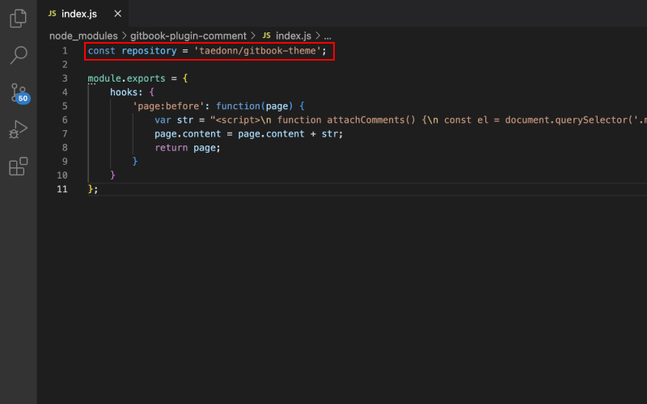

## 댓글 기능 만들기

블로그 댓글 기능을 구현하기위해 utterances라는 앱을 사용했습니다. utterances는 깃허브의 댓글 앱으로, 광고가 없고 가벼워 깃허브 기반 블로그에서 많이 사용됩니다.

&nbsp;

[https://github.com/apps/utterances](https://github.com/apps/utterances)

이 링크를 통해 utterances 앱을 설치할 수 있습니다. 링크로 들어가면 모든 저장소에 일괄적으로 설치할지, 특정 저장소에만 설치할지 선택할 수 있는데, 기호에 맞게 선택하면 됩니다.

&nbsp;

앱이 설치가 완료되면, 깃허브에서 repository > Settings > GitHub apps에서 설치된 앱을 확인할 수 있습니다.

&nbsp;

[GitBook 세팅하기](../setting_up_gitbook/README.md)에서, 위처럼 root > node_modules > gitbook-plugin-comment > index.js의 url을 변경하는 부분이 있었습니다. 이전에 수정했다면 따로 수정할 필요는 없습니다.

&nbsp;

모두 정상적으로 설치가 되면, 위처럼 글 맨 마지막 부분에 댓글을 남길 수 있는 영역이 생깁니다. 이 곳에 댓글을 남기면 댓글이 깃허브 저장소의 Issues 탭에 올라오고, 알림 설정을 통해 메일로 알림을 받을 수 있습니다.

&nbsp;