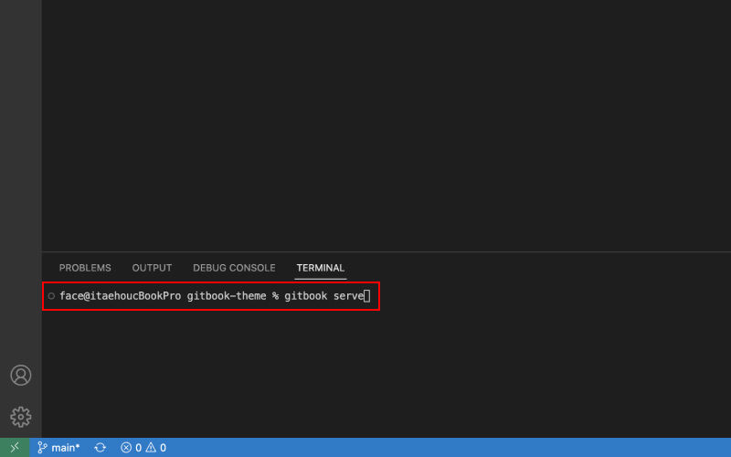
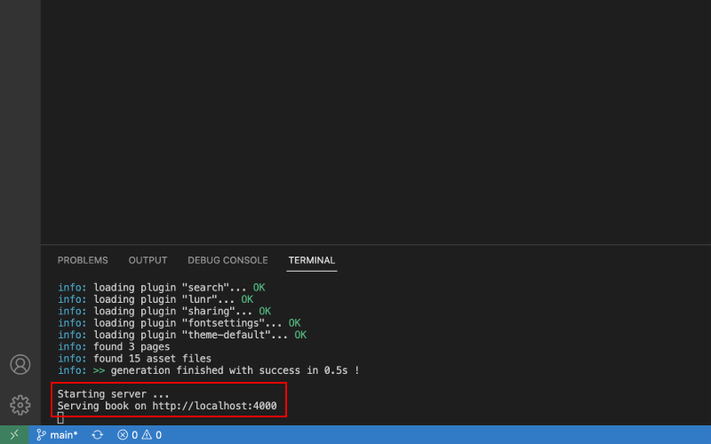
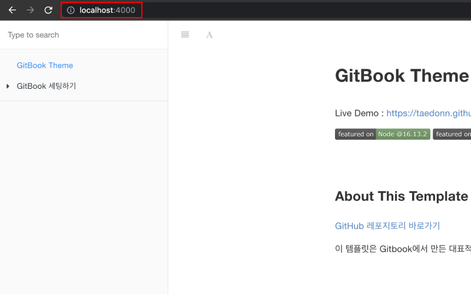

## 로컬에서 접속하기

일반적으로 블로그 플랫폼은 미리보기 기능을 제공합니다. 내가 쓰고 있는 글이, 실제 블로그에서는 어색해 보일수 있기 때문입니다. 하지만 이 블로그처럼 GitHub을 통해 만든 블로그들은, 실제 서버에 파일을 올리고 수정하기 때문에, 배포 전, 로컬 서버로 먼저 블로그에 어떻게 나오는지 확인하는 작업이 필수적입니다.

&nbsp;

로컬에서 접속하려면, 먼저 gitbook-cli를 설치해야 합니다.

[gitbook-cli 설치하는 법](../README.md/#gitbook-cli)

&nbsp;



위에서 나온대로 설치가 완료되면, 터미널에 gitbook serve 또는 npm start를 입력합니다.

&nbsp;



정상적으로 실행이 완료되면, 위처럼 http://localhost:4000 에 연결됐다고 나옵니다.

&nbsp;



위에 http://localhost:4000를 복사해서 크롬같은 브라우저의 주소창에 붙혀넣으면, 로컬에서 블로그에 접속할 수 있습니다.
> 기본적으로 수정하고나서 Ctrl(Cmd) + S로 저장하면 자동으로 미리보기도 새로고침 되지만, 미리보기가 새로고침이 안될 경우, Ctrl(Cmd) + C로 커멘드 실행을 종료하고, 다시 gitbook serve를 하면 수정사항이 반영됩니다.

> node 16.X 이후 버전에서는 미리보기가 새로고침 되지 않습니다. 미리보기가 새로고침 되길 원한다면 node를 16.X 버전으로 변경 후 이용해 주세요.

&nbsp;

### 작성 완료한 글 배포하기

이렇게 미리보기를 통해 작성한 글을 확인한 후, 배포하기를 원한다면 터미널에 아래 코드를 입력합니다.
```bash
npm run deploy
```

&nbsp;