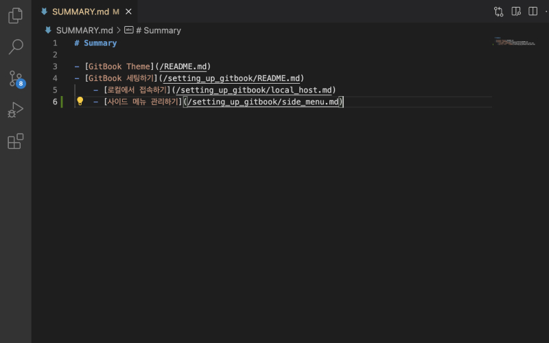
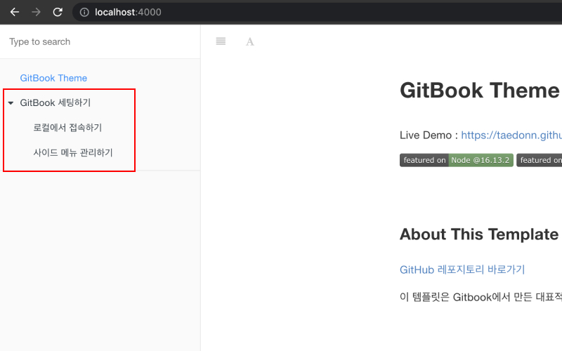

## 사이드 메뉴 관리하기

사이드 메뉴는 루트 폴더의 SUMMARY.md 파일을 통해 관리할 수 있습니다. SUMMARY.md는 GitBook에서 책의 목차를 관리하는 파일로, GitBook Theme에서는 사이드 메뉴로 표시됩니다.

&nbsp;

GitBook Theme의 사이드 메뉴는 Markdown의 목록 표기 방식에 대응하여 표현됩니다.

&nbsp;

목록에 뎁스를 넣을 경우 그룹으로 묶여, 화살표를 통해 숨김/보임 처리를 할 수 있습니다.

&nbsp;